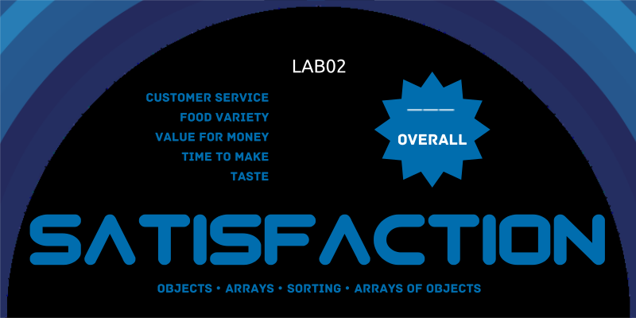

<div align="center">




&nbsp;

&nbsp;

&nbsp;

&nbsp;

&nbsp;

---

</div>

[TOC]

# Due Date

Week 3 Monday 5:00 pm [Sydney Local Time](https://www.timeanddate.com/worldclock/australia/sydney)

# Background

## Rationale

With the rise of many fast-food franchises in recent times, each with its perks and quirks, it can often be difficult to decide on what's best to eat on your cheat day.

In this lab, we first attempt to rank fast food restaurants based on an ordered set of criteria similar to those from [Canstar Blue](https://www.canstarblue.com.au/stores-services/fast-food-restaurants/), then with **our satisfaction metric**. This will allow us to always be able to determine the best place to eat from a given set of options.

## Setup

- If you are working on a CSE machine (e.g. via VLAB), ensure that you've run the command `1531 setup`. You only need to do this once at the beginning of the course.
- Please make sure you have completed `lab02_arrays` prior.
- Copy the SSH clone link from Gitlab and clone this repository on either VLAB or your local machine.
- In your terminal, change your directory (using the `cd` command) to the newly cloned lab. To check if you have done this correctly, type `ls` in this new directory to see if you can see the relevant files (including [satisfaction.js](satisfaction.js)).

## Interface: Functions

<table>
  <tr>
    <th>Name & Description</th>
    <th>Parameters</th>
    <th>Return Type</th>
    <th>Errors</th>
  </tr>
  <tr>
    <td>
        <code>sortedFastFood</code><br /><br />
        Given an array of fast food restaurants, return a new sorted array in <b>descending order</b> by:<br/><br/>
        <ol>
            <li>customerService</li>
            <li>foodVariety</li>
            <li>valueForMoney</li>
            <li>timeToMake</li>
            <li>taste</li>
            <li>name (in <b>ascending lexicographical order</b>, case-insensitive)</li>
        </ol>
        For example, if two restaurants have the same customerService and foodVariety, the one with a higher valueForMoney will be in front (nearer to the start of the returned array).
        <br/><br/>
        If all other fields are equal and the name is compared, "hungry Jacks" will be before "KFC" because "h" is before "K".
        <br/><br/>
        You should NOT modify the order of the original array.
        <br/><br/>
        <b>Difficulty</b>: ⭐⭐⭐
    </td>
    <td>
        (fastFoodArray)
    </td>
    <td>
        <code>fastFoodArray</code>
    </td>
    <td>
        N/A
    </td>
  </tr>
  <tr>
    <td>
        <code>sortedSatisfaction</code><br /><br />
        Given an array of fast food restaurants, return a new sorted
        array ranked by the overall satisfaction (highest first).
        <br/><br/>
        See below for a mathematical representation of the satisfaction formula.
        <br/><br/>
        If two restaurants have the same satisfaction, the names
        are compared in ascending lexicographical order (case-insensitive).
        For example, "hungry Jacks" will appear before "KFC" because
        "h" is before "K".
        <br/><br/>
        You should NOT modify the order of the original array.
        <br/><br/>
        <b>Difficulty</b>: ⭐⭐⭐
    </td>
    <td>
        (fastFoodArray)
    </td>
    <td>
        <code>satisfactionArray</code>
    </td>
    <td>
        N/A
    </td>
</table>

### Satisfaction Formula

The satisfaction of a restaurant is the average score between `customerService`, `foodVariety`, `valueForMoney`, `timeToMake` and `taste`. This can be represented mathematically as:

```math
\text{satisfaction} =
\frac{
    \text{customerService}
    + \text{foodVariety}
    + \text{valueForMoney}
    + \text{timeToMake}
    + \text{taste}
}
{5}
```

You do not need to round the satisfaction value.

## Interface: Data Types

| If the variable name             | It is of type                                                                                                                      |
| -------------------------------- | ---------------------------------------------------------------------------------------------------------------------------------- |
| is exactly **fastFoodArray**     | `Array` of objects, where each `object` contains the keys `{name, customerService, foodVariety, valueForMoney, timeToMake, taste}` |
| is exactly **name**              | `string`                                                                                                                           |
| is exactly **customerService**   | `number`                                                                                                                           |
| is exactly **foodVariety**       | `number`                                                                                                                           |
| is exactly **valueForMoney**     | `number`                                                                                                                           |
| is exactly **timeToMake**        | `number`                                                                                                                           |
| is exactly **taste**             | `number`                                                                                                                           |
| is exactly **restaurantName**    | `string`                                                                                                                           |
| is exactly **satisfactionArray** | `Array` of objects, where each `object` contains the keys `{restaurantName, satisfaction}`                                         |
| is exactly **satisfaction**      | `number`                                                                                                                           |

## Example Array Structure

Below is an example of a `fastFoodArray` that you will receive in your functions.

```js
const fastFoodArray = [
  {
    name: "mcdonalds",
    customerService: 3,
    foodVariety: 3,
    valueForMoney: 3,
    timeToMake: 4,
    taste: 3,
  },
  {
    name: "kfc",
    customerService: 4,
    foodVariety: 3,
    valueForMoney: 4,
    timeToMake: 4,
    taste: 3,
  },
];
```

Once you have implemented all functions, the output of the starter debugging `console.log` (assuming you have not modified the input array) is:

<details close>
<summary>click to view sample output</summary>

```
$ node satisfaction.js
========================
1. Testing Fast Food
===========
[
  {
    name: 'First fastFood, second satisfaction (4.6)',
    customerService: 5,
    foodVariety: 5,
    valueForMoney: 5,
    timeToMake: 4,
    taste: 4
  },
  {
    name: 'Second fastFood, third satisfaction (4.6)',
    customerService: 5,
    foodVariety: 5,
    valueForMoney: 5,
    timeToMake: 4,
    taste: 4
  },
  {
    name: 'Third fastFood, first satisfaction (4.8)',
    customerService: 5,
    foodVariety: 4,
    valueForMoney: 5,
    timeToMake: 5,
    taste: 5
  }
]

========================
2. Testing Satisfaction
===========
[
  {
    restaurantName: 'Third fastFood, first satisfaction (4.8)',
    satisfaction: 4.8
  },
  {
    restaurantName: 'First fastFood, second satisfaction (4.6)',
    satisfaction: 4.6
  },
  {
    restaurantName: 'Second fastFood, third satisfaction (4.6)',
    satisfaction: 4.6
  }
]
```

Note that having the same output does not guarantee that your function will behave correctly in all cases (e.g. empty array, one element, many elements, etc).

While manually testing, you are welcome to make up your data or use those provided by
[Canstar Blue](https://www.canstarblue.com.au/stores-services/fast-food-restaurants/).
Note that the [Satisfaction Formula](#satisfaction-formula) that we use may be different.

</details>

# Task

## Implementation

Open the file [satisfaction.js](satisfaction.js) in your preferred text editor. The stub code for each function has been provided for you.

Complete each function in [Interface: Functions](#interface-functions).

### Tips & Hints

- You may want to introduce a helper function that compares two restaurants and return a positive, zero, or negative number depending on whether the first or second restaurant is considered "better".
- You may find the `.sort()` method of arrays useful, although this lab can be completed without it. **An example of an approach that does NOT use .sort() is in the file [sample.js](sample.js)**.
- For sorting lexicographically, you may want to look into the `.localeCompare` method for strings!
- Be careful with `"name"` vs `"restaurantName"` - read the specification carefully!

## Assumptions

1. All restaurant names will be case-insensitively unique.
   - For example, if there is a restaurant `"KFC"`, there will not be another restaurant named `"kfc"`, `"kFc"` or `"KFc"`.
1. You do not need to round the value of satisfaction.
1. All objects in the fastFoodArray will follow the same structure from [Interface: Data Types](#interface-data-types).

## Run & Test

You can run and test your code by typing the following in a terminal opened at the directory (folder) for this lab:

```shell
$ node satisfaction.js
```

This executes the code in [satisfaction.js](satisfaction.js). Refer back to the [Expected Array Structure](#example-array-structure) for the expected output.

## Output format of console.log

When debugging your code, you *may* find that the output of `console.log` has:
- different colours (e.g. yellow/brown for numbers)
- different spacing (e.g. spaces between brackets)
- new lines (e.g. after an opening bracket)
- other slight differences in indentation, commas, etc

This is completely fine. What matters is the returned value of your functions, which is what we will be assessing you on.

Using `console.log` is strictly for debugging purposes. It will not affect your mark in any way. In other words, how your results are displayed when printed or whether you leave these `console.log` statements in your code has 0 effects on your final automarking result.

# Submission

- Use `git` to `add`, `commit`, and `push` your changes on your master branch.
- Check that your code has been uploaded to your Gitlab repository on this website (you may need to refresh the page).

**If you have pushed your latest changes to master on Gitlab no further action is required! At the due date and time, we automatically collect your work from what's on your master branch on Gitlab.**

# Notes

- Passing the given tests is a good indication of correctness but does not guarantee that you will receive the full mark for the lab.
- You are advised to do further testing.
- You are not allowed to use any external libraries/modules in this exercise. This simply means you cannot use the command `npm install`.
